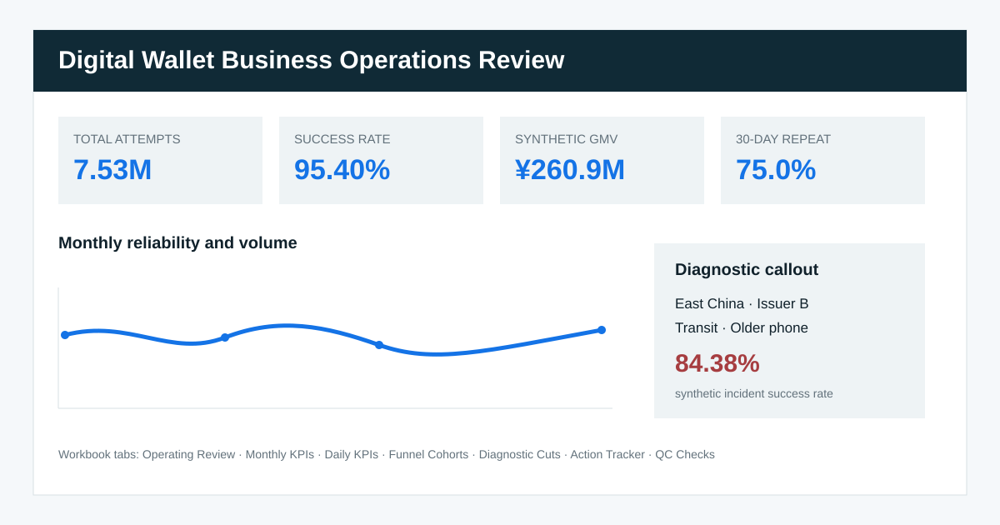
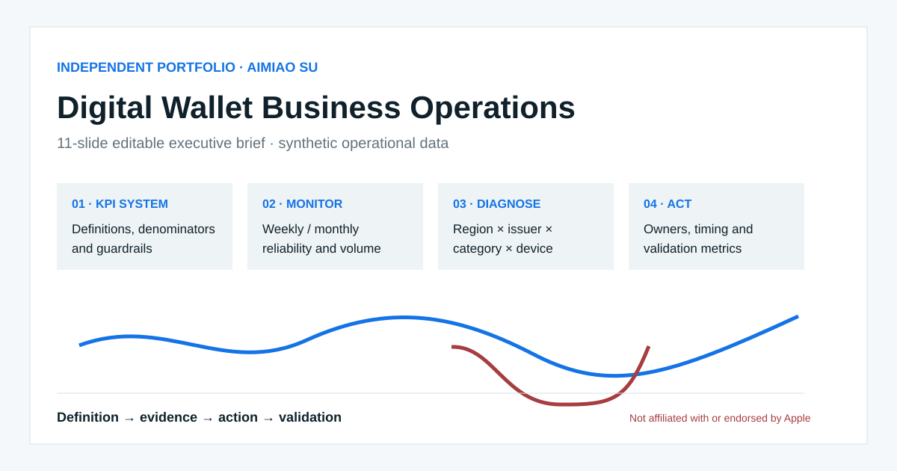

# Digital Wallet Business Operations Analytics Portfolio

> **Prominent disclaimer:** This is an independent portfolio project by **Aimiao Su**. It is **not affiliated with, sponsored by, or endorsed by Apple Inc.** All operational data are deterministic synthetic data; no personal payment data or direct identifiers are included.

An end-to-end operating analytics case tailored to an Apple Pay Business Operations internship: weekly/monthly KPI monitoring, metric-system design, funnel/cohort analysis, a planted operational diagnostic, owner-based actions, lifecycle governance, Excel-ready tables, SQL, an editable browser-based executive brief, and a dashboard.

**中文导航：** 这是一个面向数字钱包业务运营岗位的独立作品集，不代表 Apple 官方项目。内容包括周/月度 KPI、指标口径、激活与留存漏斗、异常诊断、行动跟踪、项目全生命周期管理、SQL、Excel 可导入表、交互式网页仪表盘和英文汇报材料。全部运营数据为合成数据，不包含个人支付信息。

## 60-second walkthrough

| Time | Open | What it demonstrates |
|---:|---|---|
| 0–10s | [`dashboard/index.html`](dashboard/index.html) | Filterable KPI monitoring and diagnostic narrative |
| 10–25s | [`assets/workbook_review.svg`](assets/workbook_review.svg) + [`data/processed/`](data/processed/) | Inspectable operating-review preview and Excel-ready KPI tables |
| 25–40s | [`deck/executive_brief.html`](deck/executive_brief.html) | Print-ready executive diagnosis and recommendation |
| 40–50s | [`sql/analysis_queries.sql`](sql/analysis_queries.sql) | KPI, funnel, cohort, segment and anomaly queries |
| 50–60s | [`docs/PROJECT_LIFECYCLE.md`](docs/PROJECT_LIFECYCLE.md) | Pre-launch, launch and post-launch governance |

## Synthetic portfolio findings

- The generated 2025 portfolio contains **7.53M attempts**, **7.18M successful transactions**, a **95.40% weighted success rate**, and **¥260.9M synthetic GMV**. GMV is not revenue.
- A deliberately planted issue lowers the affected cut from a **96.26% pre-incident baseline** to **84.38%** during 15 Sep–5 Oct 2025.
- The lowest-performing cut is **East China / Issuer B / Transit / Older phone**; device, issuer, region and category controls isolate the problem without implying a confirmed technical root cause.
- Recommended operating response: validate response-code/route mapping, reproduce in a controlled test matrix, prepare a bounded fix, and require seven complete days within 0.5 percentage points of baseline before closure.

These are findings from the synthetic portfolio dataset—not statements about Apple, Apple Pay, any real issuer, merchant or customer.

## Role-fit matrix

| Target responsibility | Evidence in this repository |
|---|---|
| Weekly/monthly KPI monitoring | Daily and monthly Excel-ready extracts, weighted KPI SQL and dashboard review |
| Adaptable reporting framework | Metric glossary, dimensional cuts, filters and file-based BI handoff |
| Ad hoc diagnosis | Volume-guarded anomaly query and control-segment diagnostic case |
| Data/metric-system construction | Fact/dimension model, dictionary, glossary and denominator definitions |
| Full-lifecycle project support | Pre-launch/launch/post-launch milestones, risks, dependencies and governance |
| Progress control | Owner, timing, status, priority and validation-metric action tracker |
| Communication | Executive deck, business review pack and interview talking points |
| Detail orientation | Deterministic seed, reconciliation tests, formula checks and CI |

## Visual preview





## Data model

The fact table grain is one **calendar day × broad region × fictional issuer × merchant category × device segment**. It contains aggregate counts only. Dimension CSVs support BI import; cohort data are stored separately at weekly eligibility-cohort grain.

```text
dashboard/      self-contained offline HTML dashboard with filters
data/raw/       readable aggregate fact sample + funnel cohorts
data/processed/ daily/monthly KPI tables + dimension CSVs
data/           SQLite database generated locally by the deterministic script
sql/            schema, transformations/analysis and quality tests
deck/           self-contained, print-ready executive HTML brief
docs/           dictionary, glossary, review, diagnosis, actions, lifecycle, BI handoff
scripts/        clean-check validation entry point
```

## Reproduce and validate

Requirements: Python 3.10+; SQLite is optional for interactive querying.

```bash
git clone https://github.com/aimiaosu-blip/apple-pay-business-operations-portfolio.git
cd apple-pay-business-operations-portfolio
python scripts/generate_data.py   # creates the full CSV and SQLite database
python scripts/rebuild.py --check
python -m http.server 8000 -d dashboard
```

Then open `http://localhost:8000`. Query the ready database with:

```bash
sqlite3 data/apple_pay_operations.sqlite < sql/quality_tests.sql
sqlite3 data/apple_pay_operations.sqlite < sql/analysis_queries.sql
```

## KPI definitions

- Transaction success rate = `SUM(successful_transactions) / SUM(attempts)`.
- Activation rate = activated devices / eligible devices.
- First-transaction rate = devices with a first transaction / activated devices.
- 30-day repeat = devices with repeat activity within 30 days / devices with a first transaction.
- Segment rankings require a minimum-volume guardrail; partial periods should not be compared with complete periods.

Full definitions: [`docs/METRIC_GLOSSARY.md`](docs/METRIC_GLOSSARY.md). Field-level documentation: [`docs/DATA_DICTIONARY.md`](docs/DATA_DICTIONARY.md).

## Methods, privacy and limitations

- Fixed seed: `20260810`; the generator creates 87,600 aggregate fact rows, 365 daily KPI points and 52 weekly cohorts. The repository includes a human-readable 14-day fact sample; `generate_data.py` recreates the complete CSV and SQLite database.
- No names, card numbers, account/device/merchant/transaction identifiers, precise locations or other direct identifiers.
- Issuer labels are fictional; all values and findings are illustrative.
- The planted anomaly proves the analytical workflow, not a real-world root cause. Real diagnosis would require governed logs, response codes and partner context.
- Static HTML and CSVs are snapshot/file-refresh artifacts, not live Apple systems.
- The executive brief contains no Apple logos or proprietary assets and can be printed to PDF from a browser.
- GitHub's publication safety layer did not permit the opaque binary workbook. The repository therefore publishes inspectable CSV tables and an SVG workbook review that can be opened/imported in Excel; no binary `.xlsx` is included.

## Operating artifacts

- [Weekly/monthly business review](docs/BUSINESS_REVIEW.md)
- [Diagnostic case](docs/DIAGNOSTIC_CASE.md)
- [Recommendation and action tracker](docs/ACTION_TRACKER.md)
- [Project lifecycle](docs/PROJECT_LIFECYCLE.md)
- [Tableau / Power BI handoff](docs/BI_HANDOFF.md)

## Interview and resume handoff

See [`docs/INTERVIEW_TALKING_POINTS.md`](docs/INTERVIEW_TALKING_POINTS.md) for the talk track and two truthful resume bullets. Aimiao Su is pursuing a Master’s in Marketing at Stockholm University (expected 2027) and brings prior experience in data governance, workflow automation, KPI monitoring, SQL, JIRA-enabled project tracking and executive reporting. This repository does not represent any portfolio result as a prior-employer achievement.
